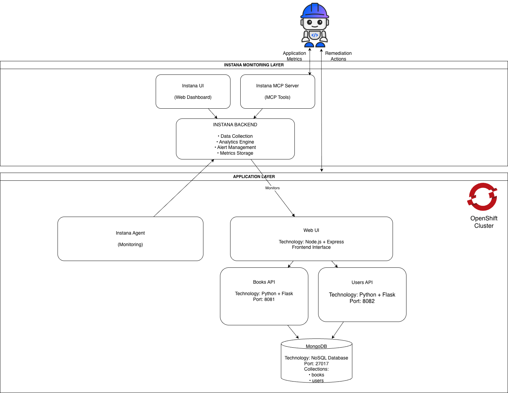

### Architecture Overview

This solution demonstrates an AI-assisted Site Reliability Engineering (SRE) workflow using IBM Instana for observability and an MCP-enabled AI assistant for diagnostics and remediation. The architecture consists of two primary layers: the **Instana Monitoring Layer** and the **Application Layer**, deployed on an OpenShift cluster.

#### Instana Monitoring Layer

The monitoring layer provides end-to-end observability and AI-driven operational insights.

* **Instana Agent** continuously collects telemetry data, traces, metrics, and logs from the application components running in the OpenShift cluster.
* The collected telemetry is sent to the **Instana Backend**, which performs data ingestion, analytics, alert management, and metric storage.
* The **Instana UI** provides a centralized dashboard for visualizing application health, service dependencies, performance metrics, and incidents.
* The **Instana MCP Server** exposes Instana observability data through MCP (Model Context Protocol) tools, enabling AI assistants such as IBM Bob to securely access runtime information.

#### AI-Assisted Operations

An AI assistant (IBM Bob) interacts with the Instana MCP Server to retrieve real-time application metrics, traces, and incident details. Using this observability data, the assistant can:

* Analyze application performance issues.
* Identify root causes of failures and latency problems.
* Correlate service dependencies and runtime anomalies.
* Recommend or execute remediation actions.

This creates a closed-loop operational model where monitoring data is transformed into actionable insights and automated remediation.

#### Application Layer

The sample application represents a simple library-system composed of multiple microservices:

* **Web UI**

  * Built using Node.js and Express.
  * Communicates with backend microservices to manage library operations.

* **Books API**

  * Implemented using Python and Flask.
  * Runs on port **8081**.
  * Provides CRUD operations for book management.

* **Users API**

  * Implemented using Python and Flask.
  * Runs on port **8082**.
  * Provides CRUD operations for user management.

* **MongoDB**

  * Serves as the persistent data store.
  * Stores application data in dedicated collections for books and users.
  * Runs on the default MongoDB port **27017**.

#### End-to-End Flow

* Users interacts in IBM Bob to get application metrics and understand current issues.
* IBM Bob accesses runtime metrics through the MCP Server, performs diagnostics, identifies root causes, and can initiate remediation actions when authorized to underlying application platform.

This architecture showcases how observability, AI-assisted diagnostics, and automated remediation can be combined to improve application reliability and accelerate incident resolution.
